Perfect Pitcher - Client Application

A modern web application for creating presentations and managing projects with AI integration, built on cutting-edge technologies.

## 🚀 Tech Stack

- **Frontend**: Next.js 15 with React 19 and TypeScript
- **UI Framework**: Tailwind CSS v4 + shadcn/ui components
- **Database**: PostgreSQL with Prisma ORM
- **Authentication**: NextAuth.js v5
- **Web3**: Wagmi + RainbowKit for wallet integration
- **AI Integration**: OpenAI GPT-4 + Realtime API
- **Styling**: Tailwind CSS v4 with animations
- **Validation**: Zod for data schemas

## ✨ Features

- 🎯 **AI Agent** with voice and text chat capabilities
- 🌐 **Web3 Integration** with wallet support and token system
- 💳 **Payment Processing** via Stripe integration
- 🌍 **Internationalization** support for 7 languages
- 🎨 **Modern UI** with customizable themes and animations
- 📱 **Responsive Design** with mobile support
- 🔐 **Secure Authentication** with multiple OAuth providers
- 📊 **Project Management** with AI-powered generation
- 🎪 **Presentation Builder** with slide editor

## 🏗️ Project Structure

```
client/
├── src/
│   ├── app/                    # App Router (Next.js 13+)
│   │   ├── (app)/             # Main application routes
│   │   ├── (auth)/            # Authentication routes
│   │   ├── (examples)/        # UI examples
│   │   ├── (view)/            # Content viewing
│   │   └── api/               # API routes
│   ├── components/            # React components
│   ├── lib/                   # Utilities and configuration
│   ├── hooks/                 # Custom React hooks
│   ├── providers/             # Context providers
│   └── types.ts               # TypeScript types
├── prisma/                    # Database and migrations
├── public/                    # Static files
└── registry/                  # shadcn/ui components
```

## 🚦 Getting Started

### Prerequisites

- Node.js 18+ 
- pnpm package manager
- PostgreSQL database

### Installation

1. Clone the repository:
```bash
git clone <repository-url>
cd perfect-pitcher-core/client
```

2. Install dependencies:
```bash
pnpm install
```

3. Set up environment variables:
```bash
cp .env.example .env.local
```

Fill in the required environment variables:
- `DATABASE_URL` - PostgreSQL connection string
- `AUTH_SECRET` - NextAuth secret key
- `OPENAI_API_KEY` - OpenAI API key
- `GOOGLE_ID`, `GOOGLE_SECRET` - Google OAuth credentials
- `GITHUB_ID`, `GITHUB_SECRET` - GitHub OAuth credentials
- `RESEND_*` - Email service configuration

4. Set up the database:
```bash
pnpm db:push
pnpm db:generate
```

5. Start the development server:
```bash
pnpm dev
```

Open [http://localhost:3000](http://localhost:3000) to view the application.

## 📖 Available Scripts

- `pnpm dev` - Start development server with Turbopack
- `pnpm build` - Build the application for production
- `pnpm start` - Start production server
- `pnpm lint` - Run ESLint
- `pnpm lint:fix` - Fix ESLint issues
- `pnpm typecheck` - Run TypeScript type checking
- `pnpm format:write` - Format code with Prettier
- `pnpm db:migrate` - Run database migrations
- `pnpm db:studio` - Open Prisma Studio
- `pnpm db:reset` - Reset database

## 🗄️ Database Schema

### Core Models

- **User** - Users with Web3 wallet support
- **Project** - User projects with AI generation
- **Story** - Presentations with slides
- **Slide** - Individual presentation slides
- **Element** - Elements within slides
- **Payment** - Stripe payment records
- **TokenTransaction** - Internal token transactions
- **AgentSession** - AI agent chat sessions

## 🔐 Authentication

The application supports multiple authentication methods:

- **Google OAuth** - Sign in with Google
- **GitHub OAuth** - Sign in with GitHub  
- **Email/Password** - Traditional credentials
- **Magic Link** - Passwordless email authentication

## 🌐 API Routes

### Main Endpoints

- `GET /api/projects` - List user projects
- `POST /api/projects` - Create new project
- `GET /api/stories` - List presentations
- `POST /api/stories` - Create presentation
- `POST /api/agent/chat` - Chat with AI agent
- `POST /api/session` - Create OpenAI Realtime session

## 🎨 UI Components

Built with **shadcn/ui** component system:

- **Style**: New York variant
- **Theme**: Neutral base color with CSS variables
- **Icons**: Lucide React
- **Responsive**: Mobile-first design
- **Accessible**: ARIA compliant components

### Key Features

- Dark/Light theme support
- Custom color schemes
- Smooth animations
- Touch-friendly mobile interface

## 🤖 AI Integration

### OpenAI Features

- **GPT-4** for text-based conversations
- **Realtime API** for voice interactions
- **Function calling** for navigation and app control
- **Image analysis** for uploaded files
- **Context awareness** for project-specific assistance

### Agent Capabilities

- Navigate through application pages
- Create and manage projects
- Analyze uploaded files and images
- Provide real-time assistance
- Voice and text interaction modes

## 🌍 Internationalization

Supported languages:
- English (default)
- Russian
- Spanish
- French
- German
- Chinese
- Japanese

Dynamic locale switching with preference persistence.

## 🔌 Web3 Integration

- **Wallet Connection**: RainbowKit for multiple wallet support
- **Token System**: Internal token management
- **Balance Tracking**: Real-time balance updates
- **Transaction History**: Complete transaction logs

## 💰 Payment System

- **Stripe Integration**: Secure payment processing
- **Webhook Handling**: Automated status updates
- **Token Rewards**: Automatic token allocation
- **Subscription Support**: Recurring payment capabilities

## 🚀 Performance

### Optimizations

- **App Router**: Next.js 13+ for improved performance
- **Server Components**: Reduced client-side JavaScript
- **Turbopack**: 5x faster development builds
- **Image Optimization**: Automatic image optimization
- **Code Splitting**: Automatic bundle splitting

### Caching

- Server Component caching
- SWR for client-side data
- Prisma connection pooling
- Static asset optimization

## 🔒 Security

- **NextAuth.js**: Secure authentication flows
- **CSRF Protection**: Built-in protection
- **Input Validation**: Zod schema validation
- **SQL Injection Prevention**: Prisma parameterized queries
- **Environment Validation**: Type-safe environment variables

## 📊 Monitoring

### Built-in

- Vercel Analytics for performance monitoring
- Development console logging
- React Error Boundaries

### Recommended

- Sentry for error tracking
- PostHog for user analytics
- Uptime monitoring services

## 🚀 Deployment

### Production Ready

- TypeScript type checking
- ESLint + Prettier code quality
- Prisma database migrations
- Environment variable validation
- Build optimization

### Environment Setup

All required environment variables are defined in `env.mjs` with type validation.

### Database

- PostgreSQL with JSON field support
- Automatic migrations via Prisma
- Seed data for initial setup

## 📝 Documentation

For detailed technical documentation, see [TECHNICAL_DOCUMENTATION.md](./TECHNICAL_DOCUMENTATION.md).

## 🤝 Contributing

1. Fork the repository
2. Create a feature branch: `git checkout -b feature/new-feature`
3. Commit changes: `git commit -am 'Add new feature'`
4. Push to branch: `git push origin feature/new-feature`
5. Submit a Pull Request

## 📄 License

This project is licensed under the MIT License - see the LICENSE file for details.

## 🙋‍♂️ Support

For support and questions:
- Create an issue in the repository
- Check the documentation
- Review existing discussions

---

**Perfect Pitcher** - Where AI meets presentation excellence! 🎯✨

# Perfect Pitcher Token ($PRFCT) - Core Blockchain

> **Production-ready upgradeable smart contract for SaaS platform on Core blockchain with integrated DEX and enterprise-grade security system**

## 🚀 Project Overview

Perfect Pitcher Token (PRFCT) is a comprehensive solution for SaaS platforms specializing in AI-powered content generation, built on the Core blockchain. The contract leverages UUPS (Universal Upgradeable Proxy Standard) architecture and includes a built-in DEX for seamless CORE/USDT → PRFCT conversions.

### ✨ Key Features & Competitive Advantages

- **🔄 Future-Proof Upgradeable Architecture** - UUPS pattern ensures seamless updates without data loss or service interruption
- **💰 Advanced SaaS Tokenomics** - Intelligent spending system for AI services with deflationary burning mechanism
- **🔒 Smart Resource Locking** - Time-based token locking for live broadcasts with AI agents and content creation
- **💱 Integrated DEX Solution** - Native automated swaps via IceCreamSwap eliminating external exchange dependencies  
- **🛡️ Enterprise-Grade Security** - Multi-layered protection with role-based access, selective pausing, and reentrancy guards
- **📊 Real-Time Analytics** - Comprehensive monitoring with event tracking and performance metrics
- **⚡ Gas-Optimized Operations** - Batch operations, storage packing, and unchecked arithmetic for minimal transaction costs
- **🏗️ Modular Architecture** - Clean separation of concerns enabling easy maintenance and feature additions
- **🔗 Oracle Integration** - Chainlink price feeds for accurate valuation and slippage protection
- **💡 AI-First Design** - Purpose-built for modern AI applications with content generation and live streaming focus

## 📋 Technical Specifications

| Parameter | Value | Description |
|-----------|-------|-------------|
| **Blockchain** | Core (EVM-compatible) | High-performance, Bitcoin-secured network |
| **Solidity** | ^0.8.24 | Latest stable version with advanced features |
| **Architecture** | UUPS Upgradeable Proxy | Industry-standard upgradeability pattern |
| **Total Supply** | 10,000,000,000 PRFCT | Maximum possible supply with deflationary mechanics |
| **Initial Supply** | 1,000,000,000 PRFCT | Conservative initial distribution |
| **Treasury Fee** | 1% on DEX swaps | Sustainable revenue model |
| **Gas Limits** | < $0.01 per transaction | Optimized for high-frequency operations |
| **Upgrade Security** | Multi-signature required | Enhanced security for contract updates |
| **Oracle Refresh** | 24-hour max age | Real-time price accuracy |

## 🛠️ Installation & Setup

### Prerequisites

```bash
node >= 16.x    # Required for latest Hardhat features
npm >= 8.x      # Package management
git >= 2.0      # Version control
```

### Clone and Install

```bash
git clone <repository-url>
cd perfect-pitcher-core/contract
npm install     # Installs all dependencies including OpenZeppelin and Chainlink
```

### Environment Configuration

```bash
cp env.example .env
# Edit .env file with your specific parameters:
# - PRIVATE_KEY: Your deployment wallet private key
# - CORE_RPC_URL: Core network RPC endpoint
# - TREASURY_ADDRESS: Treasury wallet for fees
```

### Contract Compilation

```bash
npm run compile     # Compiles all contracts with optimization enabled
```

## 🧪 Comprehensive Testing Suite

### Run All Tests

```bash
npm test                    # Executes complete test suite
```

### Gas Reporting

```bash
REPORT_GAS=true npm test   # Detailed gas usage analysis
```

### Targeted Test Suites

```bash
# Security & Attack Vector Tests
npx hardhat test --grep "Security"

# SaaS Functionality Tests  
npx hardhat test --grep "SaaS"

# Upgrade Mechanism Tests
npx hardhat test --grep "Upgrade"

# Integration Tests
npx hardhat test --grep "Integration"

# Performance Benchmarks
npx hardhat test --grep "Performance"
```

### Test Coverage Analysis

```bash
npm run coverage           # Generates detailed coverage report
```

## 🚀 Deployment Guide

### Core Testnet Deployment

```bash
# Check deployer balance first
npm run check:balance

# Deploy to testnet
npm run deploy:testnet

# Verify contract on explorer
npm run verify
```

### Core Mainnet Deployment

```bash
# Production deployment with extra safety checks
npm run deploy:mainnet

# Post-deployment verification
npm run verify --network core
```

### Contract Verification

```bash
# Automatic verification during deployment
npx hardhat verify --network coreTestnet <CONTRACT_ADDRESS>

# Manual verification with constructor args
npx hardhat verify --network coreTestnet <CONTRACT_ADDRESS> "arg1" "arg2"
```

## 📊 Monitoring & Analytics

### Launch Monitoring System

```bash
# Configure TOKEN_ADDRESS in .env after deployment
npm run monitor             # Real-time event monitoring

# Get contract statistics
npm run stats              # Current contract state analysis

# Interactive contract testing
npm run interact          # Manual function testing
```

### Key Events for Monitoring

- **ServiceSpending** - Token consumption for AI services with service type tracking
- **ResourcesLocked/Unlocked** - Time-based locks for live broadcasts and content creation
- **SwapExecuted** - DEX trades with slippage and price impact analysis
- **EmergencyEvents** - Critical security events and admin actions
- **RoleGranted/Revoked** - Access control changes for security auditing
- **Paused/Unpaused** - Contract state changes for operational monitoring
- **ConfigUpdated** - System parameter modifications
- **BatchOperations** - Multi-user operations for efficiency tracking

## 🏗️ Contract Architecture

### Core Components & Design Pattern

```mermaid
graph TB
    A[PerfectPitcherToken] --> B[ERC20Upgradeable]
    A --> C[AccessControlUpgradeable]
    A --> D[PausableUpgradeable]
    A --> E[ReentrancyGuardUpgradeable]
    A --> F[UUPSUpgradeable]
    
    A --> G[SaaS Functions]
    A --> H[DEX Integration]
    A --> I[Security Layer]
    A --> J[Analytics Layer]
    
    G --> G1[spendOnService]
    G --> G2[lockResourcesForBroadcast]
    G --> G3[unlockResourcesAfterBroadcast]
    G --> G4[batchOperations]
    
    H --> H1[swapCOREtoPRFCT]
    H --> H2[Price Oracles]
    H --> H3[Treasury Fees]
    H --> H4[Slippage Protection]
    
    I --> I1[Role Management]
    I --> I2[Selective Pausing]
    I --> I3[Emergency Functions]
    I --> I4[Upgrade Authorization]
    
    J --> J1[Event Tracking]
    J --> J2[Usage Metrics]
    J --> J3[Performance Analytics]
```



### Role-Based Access Control System

| Role | Description | Capabilities | Security Level |
|------|-------------|--------------|----------------|
| **DEFAULT_ADMIN_ROLE** | Master Administrator | Role management, emergency functions, system configuration | 🔴 Critical |
| **OPERATOR_ROLE** | Platform Operators | Allowance management, configuration updates, batch operations | 🟡 High |
| **SERVICE_ROLE** | AI Service Backends | Token spending authorization, service-specific operations | 🟢 Medium |
| **PAUSER_ROLE** | Security Personnel | Function pausing, emergency response, incident management | 🟡 High |
| **UPGRADER_ROLE** | Development Team | Contract upgrade authorization, implementation deployment | 🔴 Critical |

## 💼 SaaS Platform Integration

### AI Service Token Spending

```javascript
// Backend service integration
const serviceId = ethers.keccak256(ethers.toUtf8Bytes("image_generation"));
await token.connect(serviceWallet).spendOnService(
    userAddress, 
    ethers.parseEther("50"), // 50 PRFCT for image generation
    serviceId
);

// Multi-service spending with different rates
const services = [
    { id: "gpt4_text", cost: ethers.parseEther("10") },
    { id: "midjourney_image", cost: ethers.parseEther("25") },
    { id: "elevenlabs_voice", cost: ethers.parseEther("15") }
];
```

### Resource Locking for Live Broadcasts

```javascript
// User locks tokens for 1-hour live stream with AI agents
const duration = 3600; // 1 hour
const serviceId = ethers.keccak256(ethers.toUtf8Bytes("live_broadcast"));
await token.lockResourcesForBroadcast(
    ethers.parseEther("100"), // 100 PRFCT locked
    duration,
    serviceId
);

// Professional streaming with extended duration
const professionalStream = {
    amount: ethers.parseEther("500"),
    duration: 14400, // 4 hours
    features: ["AI_HOST", "REAL_TIME_ANALYTICS", "MULTI_LANGUAGE"]
};
```

### CORE to PRFCT Exchange

```javascript
// User purchases PRFCT with CORE tokens
await coreToken.approve(tokenAddress, ethers.parseEther("10"));
await token.swapCOREtoPRFCT(
    ethers.parseEther("10"), // 10 CORE input
    ethers.parseEther("990") // minimum 990 PRFCT output (1% slippage)
);

// Bulk purchase with price optimization
const bulkPurchase = {
    coreAmount: ethers.parseEther("100"),
    minPrfctOut: ethers.parseEther("9900"),
    deadline: Math.floor(Date.now() / 1000) + 300 // 5 minutes
};
```

## 🔧 Administration & Management

### Permission Management

```javascript
// Set spending limits for individual users
await token.connect(operator).setSpendingAllowance(
    userAddress, 
    ethers.parseEther("1000") // 1000 PRFCT monthly limit
);

// Batch allowance setup for multiple users
await token.connect(operator).batchSetSpendingAllowances(
    [user1, user2, user3],
    [
        ethers.parseEther("500"),  // Basic tier
        ethers.parseEther("750"),  // Premium tier  
        ethers.parseEther("1000")  // Enterprise tier
    ]
);

// Dynamic tier-based allowances
const tierLimits = {
    basic: ethers.parseEther("500"),
    premium: ethers.parseEther("2000"),
    enterprise: ethers.parseEther("10000"),
    unlimited: ethers.parseEther("1000000")
};
```

### Configuration Updates

```javascript
const newConfig = {
    maxSpendingAmount: ethers.parseEther("200000"), // 200k tokens per transaction
    maxLockDuration: 14 * 24 * 3600, // 14 days maximum lock
    serviceCount: 25, // Support for 25 different AI services
    emergencyUnlockFee: 300, // 3% penalty for early unlock
    treasuryFeeRate: 100, // 1% on all swaps
    oracleMaxAge: 86400 // 24-hour price feed freshness
};
await token.connect(operator).updateConfig(newConfig);
```

### Emergency Functions

```javascript
// Contract-wide pause for security incidents
await token.connect(pauser).pause();

// Selective function pausing for targeted issues
const selector = token.interface.getSighash("swapCOREtoPRFCT");
await token.connect(pauser).pauseFunction(selector, true);

// Emergency token recovery (only when paused)
await token.connect(admin).emergencyWithdraw(
    emergencyAddress, 
    ethers.parseEther("1000")
);

// Role-based emergency access
await token.connect(admin).grantRole(
    await token.EMERGENCY_ROLE(),
    emergencyResponder
);
```

## 🔄 Upgrade Procedures

### Preparing New Implementation

```javascript
// Deploy new implementation with enhanced features
const PerfectPitcherTokenV2 = await ethers.getContractFactory("PerfectPitcherTokenV2");
const upgraded = await upgrades.upgradeProxy(proxyAddress, PerfectPitcherTokenV2);

// Pre-upgrade validation
await upgrades.validateUpgrade(proxyAddress, PerfectPitcherTokenV2);

// Upgrade with initialization parameters
const upgradeCalldata = PerfectPitcherTokenV2.interface.encodeFunctionData(
    "initializeV2", 
    [newFeatures, enhancedLimits]
);
```

### Post-Upgrade Verification

```javascript
// Verify state preservation
const name = await upgraded.name(); // "Perfect Pitcher Token"
const totalSupply = await upgraded.totalSupply(); // Preserved from V1
const version = await upgraded.version(); // "2.0.0"

// Test new functionality
const newFeature = await upgraded.newV2Feature();
console.log("V2 feature active:", newFeature);

// Validate all existing user balances
const userBalance = await upgraded.balanceOf(userAddress);
console.log("User balance preserved:", ethers.formatEther(userBalance));
```

## 📈 Economic Model & Tokenomics

### Deflationary Mechanics

- **Service Burning** - Tokens permanently burned when used for AI services, reducing supply
- **Emergency Unlock Fees** - 3% penalty for early resource unlock goes to treasury
- **DEX Transaction Fees** - 1% fee on all swaps feeds ecosystem development
- **Stake Rewards** - Future staking mechanism for long-term holders (V2)

### Token Utility & Value Drivers

- **AI Content Generation** - Premium access to GPT-4, Midjourney, DALL-E, and custom models
- **Live Broadcasting** - Token-gated AI agent interactions and real-time content creation
- **Platform Governance** - Voting rights on platform features and parameter changes (V2)
- **Exclusive Features** - Premium tools, higher limits, and priority processing
- **Revenue Sharing** - Token holders receive portion of platform revenue (V3)

### Supply Dynamics

| Mechanism | Impact | Rate | Purpose |
|-----------|--------|------|---------|
| **Initial Supply** | +1B PRFCT | One-time | Platform bootstrap |
| **Service Burning** | -Variable | Per transaction | Deflationary pressure |
| **Lock Rewards** | +Variable | Time-based | User incentives |
| **Emergency Fees** | Treasury | 3% of early unlocks | Platform sustainability |

## 🛡️ Security & Audit

### Comprehensive Security Testing

- ✅ **100% Test Coverage** - All functions covered by comprehensive unit and integration tests
- ✅ **Reentrancy Protection** - ReentrancyGuard on all state-changing functions
- ✅ **Role-Based Access Control** - Granular permission system with principle of least privilege
- ✅ **Emergency Pause Mechanism** - Global and selective function pausing capabilities
- ✅ **Oracle Data Validation** - Chainlink price feed freshness and sanity checks
- ✅ **MEV Attack Protection** - Slippage limits and transaction deadline enforcement
- ✅ **Integer Overflow Protection** - SafeMath and Solidity 0.8+ built-in protections
- ✅ **Flash Loan Attack Mitigation** - State validation and reentrancy guards

### Security Best Practices

1. **Real-Time Monitoring** - Deploy comprehensive event monitoring and alerting system
2. **Multi-Signature Security** - Distribute critical roles across multiple secure wallets
3. **Treasury Protection** - Use battle-tested multisig wallets for treasury management
4. **Gradual Scaling** - Implement transaction limits and gradually increase based on usage
5. **Regular Audits** - Schedule periodic security reviews and penetration testing
6. **Emergency Response** - Maintain incident response procedures and emergency contacts

### Attack Vector Mitigation

| Attack Type | Protection Mechanism | Implementation |
|-------------|---------------------|----------------|
| **Reentrancy** | ReentrancyGuard modifier | All external calls protected |
| **Flash Loans** | State validation checks | Balance verification before/after |
| **Price Manipulation** | Oracle + DEX price validation | Chainlink feeds with sanity bounds |
| **Access Control** | Role-based permissions | Minimal privilege assignment |
| **Upgrade Attacks** | UPGRADER_ROLE restriction | Multi-sig upgrade authorization |

## 🏁 Quick Start Guide

```bash
# 1. Install dependencies and setup environment
npm install
cp env.example .env
# Configure .env with your deployment parameters

# 2. Compile contracts with optimization
npm run compile

# 3. Run comprehensive test suite
npm test

# 4. Check deployer balance and network status  
npm run check:balance

# 5. Deploy to Core Testnet2
npm run deploy:testnet

# 6. Verify contract on block explorer
npm run verify

# 7. Monitor contract activity (post-deployment)
npm run monitor

# 8. Interact with deployed contract
npm run interact
```

## 🚀 Production Deployment Checklist

- [ ] **Environment Setup** - Secure private key and RPC endpoints configured
- [ ] **Security Review** - All roles assigned to appropriate addresses  
- [ ] **Treasury Configuration** - Multi-signature wallet setup for fees
- [ ] **Oracle Validation** - Chainlink price feeds tested and validated
- [ ] **Monitoring Setup** - Event tracking and alerting systems deployed
- [ ] **Emergency Procedures** - Incident response plan and contact list ready
- [ ] **Documentation** - Integration guides and API documentation complete

## 📞 Support & Community

- **Technical Documentation**: [docs.perfectpitcher.com](https://docs.perfectpitcher.com)
- **GitHub Repository**: [github.com/perfect-pitcher/core](https://github.com/perfect-pitcher/core)
- **Discord Community**: [discord.gg/perfectpitcher](https://discord.gg/perfectpitcher)
- **Telegram**: [t.me/perfectpitcher](https://t.me/perfectpitcher)
- **Technical Support**: support@perfectpitcher.com
- **Security Reports**: security@perfectpitcher.com

## 📄 License & Legal

MIT License - see [LICENSE](LICENSE) file for complete terms.

### Disclaimer
This software is provided "as is" without warranty. Users are responsible for conducting their own security audits and due diligence before deploying to production networks.

---

**🎯 Ready for Production**: This contract has been thoroughly tested and optimized for real-world SaaS applications. Ensure proper security measures and monitoring before mainnet deployment.
